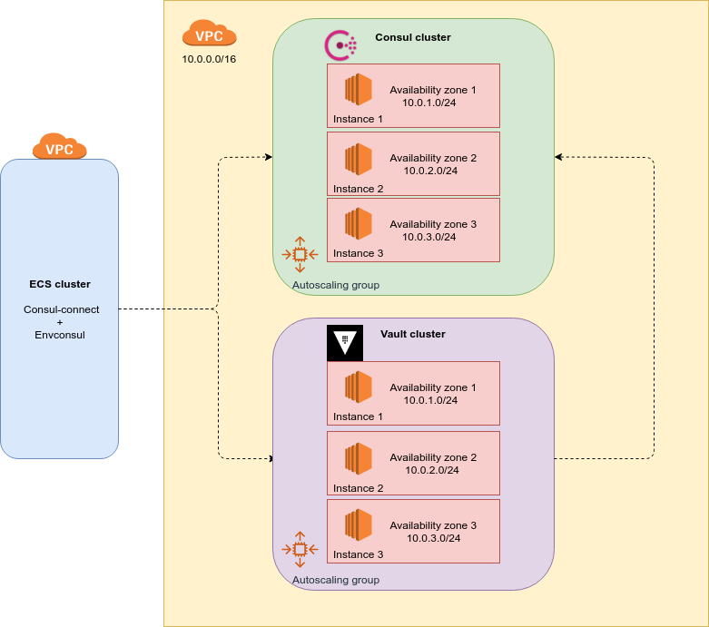

# Demo consul AWS

This repository aims to provides a way to create and install a consul and vault clusters in AWS using terraform.

# Table of Contents
1. [Assumptions](#Assumptions)
2. [Architecture](#architecture)
3. [Multi region architecture](#multi-region-architecture)
4. [Installation steps](#installation-steps)
5. [Initialize vault cluster](#initialize-vault-cluster
)


### Assumptions

* We dont create clients to connect to the consul cluster in this demo, we assume that ECS instances will connect directly to the consul cluster using envconsul + consul connect.
* We have enabled by default the public ip for each server, it's obviosly wrong for a production environment but we setup in that way to ease the demo of the exercise.
* The security groups are ready to receive requests from all the networks, in a production scenario we must remove the "0.0.0.0/0" rule from the security group module in terraform and add the subnet allowed 
in the network.

## Architecture

This demo creates a private Consul and Vault cluster. the Consul cluster is ready to receive request from external clients (for example a ECS cluster).
The Vault cluster will use Consul as storage backend. 

By default the clusters are created with 3 EC2 instances each, we recommend 3 or 5 instances in order to maintain the quorum in the cluster. We create 1 Autoscaling group
for each cluster in order to ensure the number of instances created and also share the instances between the availability zones enabled in our VPC subnets.

With the Auto Scaling Group we ensure the high availability of the clusters, sharing the instances between the availability zones enabled in our VPC and also recreating the 
instances in case of failures or termination.

The Consul servers will use the Gossip protocol in order to update the information stored between the cluster.

Clients will use Consul as DNS server to discover Vault servers.



## Multi region architecture

It's not possible create a multi master cluster between regions with Consul due to a leader would never be elected, so instead we can create a master-slave architecture using "consul-replicate" (https://github.com/hashicorp/consul-replicate).

"consul-replicate" daemon will be able to perform cross region K/B replication with low-latency asynchronous replication to other aws regions.

## Installation steps


### Prepare environmen

#### AWS credentials

```
export AWS_ACCESS_KEY_ID=XXX
export AWS_SECRET_ACCESS_KEY=XXX
export AWS_DEFAULT_REGION=XXX

```

#### Modify backend.tf

modify the backend.tf file adding the aws region and the s3 bucket name for the terraform state.

#### VPC

For this demo we assume that we have a VPC already created with subnets in differents availability zones (terraform will share the instances between that zones).

#### Install Packer

Download and install packer from https://www.packer.io

It's necessary to create the consul AMI

#### Install Terraform

Download and install terraform from https://www.terraform.io

The terraform version must be 0.12 or higher.


#### Create s3 bucket for terraform state

aws s3api create-bucket --bucket demo-consul --region us-east-1

(Don't forget update the backend.tf file with the bucket name and region.)

#### Create AMI

In order to avoid security problems, we are not going to use the public vault+consul AMI, instead we are going to build our own vault+consul AMI.

Run this command to create the AMI:

```
packer build -only ubuntu18-ami vault-consul-am/vault-consul.json
```

it will output the AMI ID necessary to create the consul cluster, we'll put it in the "ami_id" variable in terraform.tfvars file.

### Create the variables file

Create the terraform.tfvars file with the proper content.

```
ami_id = "ami-XXX"
ssh_key_name = "consul-demo"
vault_cluster_name = "vault-cluster"
consul_cluster_name = "consul-cluster"
vault_cluster_size = 3
consul_cluster_size = 3
vault_instance_type = "m3.medium"
consul_instance_type = "m3.medium"
vpc_id = "vpc-XXX"
```

### Launch Consul cluster


```
terraform init
terraform plan -out "terrafom.plan"
terraform apply "terraform.plan"
```

# Initialize Vault cluster

### Initialize
ssh to one vault server and run
```
vault operator init
```

Store in a safe place the unseal keys and the initial root token.

### Unseal vault cluster

ssh to each server and run 3 times this command (you'll need the unseal keys in order to unlock it)

```
vault operator unseal
```

### Set and get secrets
Once your cluster is unsealed, you can read and write secrets by SSHing to any of the servers:
```
ssh -i consul-demo.pem ubuntu@SERVER_IP
vault secrets enable -path=/secret kv
vault login
vault write secret/example value=secret
vault read secret/example
```

